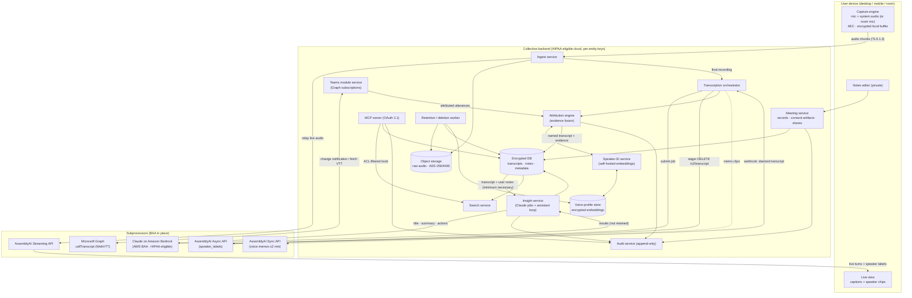

# Collective — HIPAA-Compliant Meeting Transcription & Notes

**Design Specification v1.0 — July 2026**
**Status:** Draft for review · **Author:** Product Architecture · **Audience:** Engineering, Compliance, Clinical Operations

---

## 0. Assumptions & Clarifying Questions

Per the working rules, assumptions are stated up front. Because this spec was produced in a single pass, the clarifying questions that would normally precede it are recorded here (and expanded in §8) with the assumption made for each so the design is fully reviewable — each is a one-line answer away from being incorporated.

### Assumptions

| # | Assumption | Impact if wrong |
|---|-----------|-----------------|
| A1 | The organization is a US healthcare group headquartered in **Washington State** (all-party consent, RCW 9.73.030; biometric statute RCW 19.375). Consent defaults are set WA-strict. **Revised by sponsor (2026-07-19, Q1/Q6): the organization operates as a single entity with fully shared staff, and the WA-strict consent posture is confirmed org-wide.** | Consent-workflow defaults and the state-law matrix in §2.6 would be retuned. |
| A2 | The organization already runs **Microsoft 365** (Exchange calendars, Teams, Entra ID) under Microsoft's standard HIPAA BAA. Entra ID is the identity provider. | Calendar/Teams integrations and SSO would target Google Workspace instead; the Teams module (§2.3) becomes moot. |
| A3 | Meeting content is **operational PHI-adjacent** (case conferences, referrals, scheduling huddles) rather than clinical documentation of record. The app is **not** an EHR and its notes are not chart notes; no HL7/FHIR export is required in v1. **Confirmed by sponsor (2026-07-19, Q3): purely internal operational notes.** | If output must land in the EHR, add an export/integration workstream and stricter content classification. |
| A4 | Scale is modest: **50–500 users**, tens of meetings/day, meetings ≤ 3 hours. Architecture is sized for this, not for consumer scale. | Storage/compute sizing and cost model change; design shape does not. |
| A5 | The organization can operate (directly or via a managed provider) a small amount of **self-hosted GPU inference** for speaker embeddings (§5). | Fall back to the commercial speaker-ID option scored in §5. |
| A6 | English is the primary meeting language for v1. | Multilingual support moves from v2 to v1 and constrains model choices. |

### Clarifying questions (max 5, carried into §8 with recommended defaults)

1. **Which entity list and boundaries?** How many legal entities, and do any share workforce/BAA umbrellas? **Resolved (2026-07-19): one entity, all staff shared.** Deployment configures a single entity; the per-entity partitioning machinery (§3.3) remains in the schema as headroom, with cross-entity flows dormant and hidden from the UI.
2. **Is Claude access needed inside claude.ai/Claude Desktop, or only inside our app?** The MCP server can serve both. **Resolved (2026-07-19, revised same day): v1 ships the direct Claude.ai chat connection** — Collective's MCP server is added to Claude.ai as a custom connector under the org's signed Anthropic BAA (HIPAA-ready Claude workspace); the in-app assistant is deferred to v2 (§6.2). Sponsor's product-classification note recorded in §6.5.
3. **Will any recordings be treated as part of the designated record set** (subject to patient access/amendment rights)? **Resolved (2026-07-19): no — purely internal operational notes** (A3 confirmed); no patient-access/amendment workflows or EHR export in scope.
4. **Is BYOD mobile permitted**, or only managed devices? **Resolved (2026-07-19): BYOD is allowed, with device registration** — each device's ID is registered to its user at sign-in and only registered devices may capture or cache meeting data (§2.6.1).
5. **Direct Anthropic API (with BAA + zero-data-retention) or AWS Bedrock** as the Claude path? Both are designed for in §6.5. **Resolved (2026-07-19): AWS Bedrock** — all backend Claude calls run on Bedrock under the org's AWS BAA; the direct Anthropic API remains the wired contingency. (The claude.ai chat connector is a separate Anthropic surface and is unaffected — §6.2, §6.6.)

---

## 1. Product Summary

**Collective** is a HIPAA-compliant meeting capture, transcription, and notes application for multi-entity healthcare organizations — an Otter/Granola-class product rebuilt around PHI-safe defaults. It records meetings **without ever joining a call as a bot**: on desktop it captures system audio plus the microphone directly on the user's device so it works with Zoom, Teams, Meet, or any calling app; on mobile and in conference rooms it records the room. Every meeting becomes a structured record — raw audio, a diarized transcript in which each line is attributed to a **named person** (via calendar attendees, an optional Microsoft Teams/Graph attribution module, and consent-gated voice profiles), the user's private notes, and a Claude-generated title, summary, and action-item list. A permission-aware MCP server lets users ask Claude questions across their entire meeting archive. Compliance is structural, not bolted on: end-to-end encryption, per-entity retention, role-based access with MFA, complete audit logging, recording-consent workflows tuned for all-party-consent states, biometric-consent gating for voice profiles, and BAAs with every subprocessor that touches audio or text.
## 2. Feature Specification

Organized by the eight requirement areas. Vendor capabilities cited here were verified against live documentation on **2026-07-19**; each verification is footnoted inline and consolidated in §2.9.

### 2.1 Meeting capture — two modes, no bot

Collective never joins a call as a participant. Capture happens on the user's own device, so it is inherently platform-agnostic: anything that produces call audio on the device can be captured.

#### 2.1.1 Virtual meetings (desktop)

Two synchronized channels are captured and stored as separate streams (stereo-multiplexed with aligned timestamps):

| Channel | Contains | Windows mechanism | macOS mechanism |
|---|---|---|---|
| **Mic channel** | The user (authoritative identity) | WASAPI capture client on the default/selected input device | Core Audio / AVAudioEngine input |
| **System channel** | All remote participants | **WASAPI loopback** (`AUDCLNT_STREAMFLAGS_LOOPBACK` on the render endpoint, shared-mode; no OS consent prompt is documented for loopback); upgraded to **per-process loopback** (`ActivateAudioInterfaceAsync` with `AUDIOCLIENT_ACTIVATION_TYPE_PROCESS_LOOPBACK`, build 20348+ — effectively Windows 11) to isolate just the call app's process tree and exclude e.g. music apps | **Core Audio process taps** (`CATapDescription` / `AudioHardwareCreateProcessTap`, macOS 14.2+) as the primary mechanism; **ScreenCaptureKit** audio capture (macOS 13+) as the fallback for older systems |

Design notes:

- **Platform-agnostic by construction.** We tap the OS audio path, not a vendor SDK, so Zoom, Teams, Meet, Webex, a softphone, or a browser tab are all equal citizens. Per-process capture targets the foreground call app when identifiable (improves cleanliness); whole-device loopback is the universal fallback.
- **Permissions.** Windows loopback requires no special user consent beyond mic permission for the mic channel (no loopback consent prompt is documented). macOS process taps require `NSAudioCaptureUsageDescription` and prompt the user for **system audio recording** permission on first use; the ScreenCaptureKit fallback is gated by the Privacy & Security pane (renamed **"Screen & System Audio Recording"** in macOS 15, which also re-confirms screen-capture grants periodically). First-run shows a guided System Settings walkthrough; the permission state is displayed on the capture screen and capture cannot start silently.
- **Echo handling.** If the user is on speakers, remote audio bleeds into the mic channel. The capture engine runs acoustic echo cancellation on the mic channel using the system channel as the reference signal, preserving the invariant *mic channel ≈ the user's voice only*. Headset use is detected and AEC bypassed.
- **Resilience.** Audio is written locally first (encrypted ring buffer → encrypted local file), streamed to the transcription pipeline opportunistically, and uploaded on completion. Network loss never loses audio; device-audio route changes (AirPods connect, dock/undock) are followed automatically with a gap marker in the transcript.
- **Call detection.** A lightweight audio-session observer notices sustained bidirectional call audio from known call apps and offers a "Start capture?" nudge (never auto-records; §2.6 consent gate always applies).

#### 2.1.2 Virtual meetings on mobile — the explicit fallback

iOS and Android do not let a third-party app capture another app's call audio (verified: iOS provides no API for cross-app audio capture and interrupts other apps' mic access during calls; Android's `AudioPlaybackCapture` explicitly excludes `USAGE_VOICE_COMMUNICATION` streams — see §2.9). Designing around this honestly:

- A virtual call taken on a phone is captured **acoustically**: the user puts the call on speakerphone and Collective records the room through the microphone — exactly the in-person pipeline (§2.1.3), with remote voices arriving as far-field audio.
- **Same-device caveat (flagged, not hidden):** on iOS, an active CallKit/VoIP call can interrupt or block another app's microphone session, so *recording on the same phone that hosts the call* may be impossible or degraded depending on the call app. The UI detects mic interruption and tells the user plainly, offering the two reliable patterns: (a) take the call on another device (laptop/desk phone on speaker) and record with the phone, or (b) take the call on the phone on speaker and record with their signed-in desktop app or tablet. Android generally permits concurrent mic capture (with a foreground service, mic type declared), but the same guidance is shown when capture silence is detected.
- Mobile capture always runs as a foreground service (Android) / background-audio-mode session (iOS) with a persistent visible notification — both a platform requirement and a consent affordance.

#### 2.1.3 In-person meetings

One device (phone on the table, or a desktop/laptop in a conference room) records 2–10 speakers.

- **Far-field profile:** capture at 16 kHz mono minimum (48 kHz where hardware allows, downsampled for ASR), with the device's voice-processing/beamforming input mode enabled where available; automatic gain control tuned for distant speech; a room-placement coach in the UI (level meter + "move closer" hint when SNR is poor).
- **Cross-talk and overlap** are handled downstream: the diarization engine (§2.2, §5) tolerates overlapping speech, and overlapping segments are rendered in the transcript as interleaved short turns with a subtle "crosstalk" glyph rather than silently merged. Accuracy expectations are set in the UI ("group discussions transcribe best when people speak one at a time").
- **Speaker count:** the pipeline is tuned for 2–10 speakers (diarization hint `min/max_speakers_expected` passed from the calendar attendee count when available).
- The same consent workflow applies (§2.6): visible recording state on the device, verbal-announcement script, optional audible start tone, and a room placard QR pattern for standing meetings.

### 2.2 Transcription — AssemblyAI

Three AssemblyAI products are used, each matched to its job. (All claims verified against AssemblyAI's current docs/pricing on 2026-07-19 — see §2.9.)

| Function | AssemblyAI API | Why this one |
|---|---|---|
| **Live captions during capture** | **Streaming API** (`wss://streaming.assemblyai.com/v3/ws`, Universal-Streaming / Universal-3.5 Pro Realtime) | ~300 ms latency; streaming diarization (`speaker_labels: true`) now supported, giving live "Speaker 1/2" turn labels the attribution engine upgrades in place; billed by session (~$0.15–0.45/hr) |
| **Final polished transcript** | **Pre-recorded (async) API** (`POST /v2/transcript`) with `speaker_labels: true` | The transcript of record. Highest accuracy on the complete audio; utterance- and **word-level timestamps, confidence, and per-word speaker labels** — the anchor for name attribution (§2.3); supports 2–30+ speakers with `speakers_expected` hints; files to 10 h/5 GB |
| **Dictated personal notes & voice memos** | **Sync API** (`POST https://sync.assemblyai.com/transcribe`) | True synchronous request/response — transcript in the HTTP response (~134 ms p50), no job polling; fits clips ≤ **120 s / 40 MB** (WAV/PCM 16-bit). **No diarization — by design it must never be the engine for meetings**; memos are single-speaker so none is needed. Longer memos automatically fall back to the async API |

Pipeline shape: during capture, audio streams to the Streaming API for live captions **and** is durably recorded; on stop, the full recording goes to the async API for the polished diarized transcript, which replaces the streaming text as the transcript of record (the streaming session's labels are kept only to make the live view useful). This two-pass design is deliberate — live UX from streaming, archival quality from async.

**HIPAA posture (verified):** AssemblyAI signs a standard BAA, self-served from the dashboard on any paid account, which also opts the account out of model training. Under BAA, transcript retention defaults to a 72-hour TTL (configurable down to 1 hour — we set 1 hour and delete eagerly via `DELETE /v2/transcript/{id}` after ingest); uploaded audio deletion begins within ~24–48 h; streaming operates with zero retention when opted out of training. SOC 2 Type 1 & 2; AES-256 at rest, TLS 1.3 in transit. **Flag:** AssemblyAI publishes no canonical list of BAA-covered services, so the executed BAA must explicitly enumerate the Streaming and Sync endpoints — a contract checklist item in §4, not an assumption.

### 2.3 Attendee names & speaker attribution

**Goal:** every transcript line reads "Dr. Okafor," not "Speaker A." One attribution engine serves all modes.

#### 2.3.1 The attribution engine (shared across virtual, in-person, mobile)

Inputs, in descending order of authority:

1. **Channel identity (virtual desktop only):** everything on the mic channel is the signed-in user. Absolute unless AEC flags heavy bleed.
2. **Teams/Graph native attribution** (when the module is enabled and the meeting is a Teams meeting): server-attributed utterances with participant identities (§2.3.2).
3. **Voice-profile match:** diarized clusters are matched against consented voice profiles (§2.3.3, §5).
4. **Calendar roster + contextual cues:** the event's attendee list constrains the candidate set; an LLM pass over the transcript mines address/introduction cues ("Thanks, Priya", "This is Sam from billing") to propose cluster→name hypotheses with confidence.
5. **Manual assignment:** one-tap correction in the live view or meeting detail; scope "this line / all lines by this voice."

Fusion: each diarized cluster accumulates weighted evidence from sources 1–4; a cluster is named only when its top hypothesis clears a confidence threshold **and** leads the runner-up by a margin; otherwise it renders as **"Unknown speaker n"** (gray chip) with one-tap correction. Every automatic assignment records its evidence source and score — visible on hover ("Matched by voice profile · 0.91") and stored for audit and model tuning. Corrections are immediate in the UI, retroactive across the meeting, and (for consented profile owners) feed the voice profile (§2.3.3c).

Guests and unenrolled speakers stay pseudonymous ("Guest 1") until manually named; naming a guest applies a **meeting-scoped label only** — it never creates a voice profile or persists a voiceprint (§2.6.3).

#### 2.3.2 Teams native attribution module (optional, admin-enabled)

Microsoft Teams attributes every utterance server-side to the speaking participant's verified identity. Collective retrieves this via the Microsoft Graph **callTranscript** API (all facts verified against Microsoft Learn, 2026-07-19 — §2.9):

- **Auto-detection:** when the module is on, Collective recognizes a Teams meeting on its own — the calendar event carries a Teams join URL (correlated to the Graph `onlineMeeting`), and the desktop capture engine independently detects the Teams process/call audio — so Graph attribution engages with zero user action; non-Teams meetings never touch the module.
- **Mechanics:** the backend holds a tenant-wide change-notification subscription on `communications/onlineMeetings/getAllTranscripts` (application permission `OnlineMeetingTranscript.Read.All`) plus the ad hoc equivalent `communications/adhocCalls/getAllTranscripts` (`CallTranscripts.Read.All`) — ad hoc, 1:1, group, and **PSTN** calls have been covered since the capability reached GA in March 2026. When a transcript lands, the backend fetches `…/transcripts/{id}/content` as **WebVTT** (`text/vtt`), whose `<v Participant Name>` voice tags carry speaker attribution; `metadataContent` supplies time-aligned utterance metadata. The docx format is deprecated (since May 2023) and is not used. Subscriptions must exist **before** transcription starts — another reason they are standing, tenant-wide, and auto-renewed (with `lifecycleNotificationUrl`).
- **Guided admin setup (in-app wizard, §7.3.5):** (1) enable transcription in meeting policy (`AllowTranscription`) and encourage auto-start via the organizer's "Record and transcribe automatically" meeting option, meeting **templates**, or **sensitivity labels** — **correction to the requirement as stated:** Microsoft provides *no tenant admin policy that force-starts transcription*; templates/labels (Teams Premium features) are the closest enforceable mechanism, so the wizard sets expectations accordingly and Collective additionally shows organizers a "start transcription" reminder when a Teams meeting begins un-transcribed; (2) Teams admin center → Meetings → Meeting settings → **Transcript API access → "Microsoft Graph access"** — default **Off**; (3) the separate **"Include speaker attribution"** toggle — also default Off; (4) admin consent for the application permissions; (5) a **Teams application access policy** (`New-CsApplicationAccessPolicy` / `Grant-CsApplicationAccessPolicy`) scoping which users' meetings the app may read; (6) the **billing & budget step (Q7 resolved 2026-07-19: chosen at integration setup)** — the admin either stays in evaluation mode (600 free min/app/tenant/month, then `402`) or links an **Azure subscription for metered billing** (transcript content retrieval is metered at **$0.0022/min**) and sets a monthly spend cap with alert thresholds; the module's health dashboard tracks consumption against whichever budget was selected. No Teams Premium license is required for retrieval itself.
- **Graceful degradation:** any failure — `403 GraphAccessToTranscriptsDisabled`, `403 SpeakerAttributionNotAllowed`, `402 Payment Required`, missing subscription, transcript simply never created — silently drops the meeting to the standard diarization pipeline and logs a module-health event on the admin dashboard. Users never see an error; they just get "Speaker" labels resolved by the other evidence sources.
- **Decision — the Graph transcript is a *labeling source*, not the transcript of record.** The AssemblyAI transcript remains canonical in every mode. Rationale: (a) **one pipeline** — a second transcript-of-record format would fork rendering, search, redaction, retention, and export logic for one meeting type; (b) **arrival time** — Graph transcripts become fetchable only after the meeting, while Collective's streaming transcript exists live, so the record would swap sources mid-lifecycle; (c) **in-room voices** — Teams attributes one conference-room device to one identity, so the Graph text is *wrong* about multi-voice rooms in a way our diarization + voice profiles can correct — the local audio is the richer signal; (d) **word-level alignment** — AssemblyAI gives per-word timestamps/confidence that downstream features (scrub-sync, redaction, claims about who said what) rely on; Graph VTT is utterance-grained; (e) **availability independence** — the record must not depend on an optional module, tenant toggles that default Off, or a metered budget. The Graph VTT is therefore consumed as evidence: its utterances are time-aligned (cue timestamps + fuzzy text match) to AssemblyAI's diarized clusters, projecting verified names onto clusters — and simultaneously serving as the passive-enrollment ground truth (§2.3.3b).
- **In-room limitation handled:** when several people share one device in a Teams meeting, Teams lumps their speech under one identity. The engine detects this (one Graph identity aligning to multiple acoustic clusters) and lets voice profiles split and re-attribute the room voices; the Graph name then applies only to the cluster(s) that match that identity's profile or remain best-evidenced.

#### 2.3.3 Voice profiles — "remember my voice" (universal across modes)

One persistent, **text-independent** voice profile per user, stored centrally, used identically by desktop and mobile: enroll once, recognized everywhere.

Profiles are built from three **consent-gated** sources (biometric consent model in §2.6.3):

- **(a) Active enrollment:** a ~30-second guided reading of four short prompts (§7.3.5). Meets the typical text-independent enrollment budget (§5) and gives a clean, known-identity sample.
- **(b) Passive enrollment:** when the Teams module attributes speech to a named, *consented* participant, those utterances (matched to our local audio by timestamp) become labeled training audio that creates or refines that person's profile automatically — regular Teams attendees may never perform the phrase ceremony. Passive enrollment requires its own explicit consent checkbox; without it, Graph attribution still labels transcripts but never touches a profile.
- **(c) Manual corrections:** when a user corrects "Unknown speaker → Dr. Okafor" and Dr. Okafor is a consented user, the corrected cluster's audio refines their profile (with agreement checks so a mis-correction can't poison a profile — updates require embedding consistency with the existing profile above a sanity threshold, else they queue for the profile owner to confirm).

Profile structure: **multiple embeddings per person across acoustic conditions** — at minimum separate centroid sets for near-field (headset/VoIP) and far-field (room) audio, annotated with capture context, so a person enrolled on a headset is still recognized across a conference table. Embeddings are versioned; raw enrollment audio is discarded after embedding extraction (§2.6.3).

**Matching runs in every mode, including Teams meetings** — it splits in-room voices Teams merged, covers meetings where Teams transcription never started, and covers the module being disabled. Matching is threshold-gated: below threshold → "Unknown speaker" with one-tap correction; scores and thresholds are tunable per acoustic condition. The speaker-recognition component itself — AssemblyAI diarization separates but does not identify — is specified in §5 (recommendation: self-hosted ECAPA-TDNN-class embeddings so voiceprints never leave the organization's infrastructure).

#### 2.3.4 Unknown & guest speakers

- Render as "Unknown speaker 1/2/…" in stable gray chips; one-tap naming from roster or free text.
- Free-text names are meeting-scoped labels (no directory link, no profile).
- A post-meeting nudge lists unresolved speakers ("2 speakers need names") on the detail screen — resolvable in seconds, skippable forever.
- Guests are never profiled, never passively enrolled, and their utterances are excluded from any embedding computation (§2.6.3).

### 2.4 The per-meeting record

Every meeting is one record with four layers (per-layer access rules in §2.7):

| Layer | Contents | Notes |
|---|---|---|
| **(a) Raw audio** | Encrypted original capture: mic + system channels (virtual desktop) or room mono (in-person/mobile), plus channel/route metadata | Most-restricted layer; playback streams with per-access audit; retention per entity policy |
| **(b) Transcript** | Diarized, timestamped, name-attributed utterances; per-word timings/confidence; attribution evidence per line; correction history | The AssemblyAI async result + attribution overlay; immutable base with an edit/annotation layer so corrections never destroy the original |
| **(c) Personal notes** | Each participant-user's own notes, timestamp-linked to the transcript | **Private to their author by default** (Granola model); sharing is explicit (§2.7); multiple users in the same meeting each have their own private notes layer on the same record |
| **(d) AI outputs** | Auto-generated title, one-paragraph summary, action items (with proposed assignees), generated at meeting end (§2.5) | Regenerable; user-editable; edits tracked |

Plus record-level metadata: calendar linkage, participants (attendees vs. detected speakers), consent artifacts (§2.6.2), entity ownership, sharing state, the facilitator-set **PHI flag** (§6.6), retention clock, and the full audit trail.

### 2.5 Claude integration (summarized here; full design in §6)

- **Post-meeting processing:** on stop, the backend sends the final transcript plus the requesting user's notes to Claude — served via **Amazon Bedrock** (`anthropic.claude-sonnet-5`) under the org's AWS BAA (Q5 resolution, §6.5) — to produce the title, summary, and action items. Minimum-necessary applies: attributed names, transcript text, and the author's notes go; audio, attendee emails, calendar bodies, and other users' private notes do not.
- **On-demand reference:** a permission-aware **MCP server** exposes the archive (`search_meetings`, `get_meeting`, `get_transcript`, `get_action_items`, …) so users can ask Claude about any past meeting. Auth is OAuth 2.1 against the org IdP; every tool result is filtered to the caller's access and audit-logged. **Verified constraint that shapes the design:** Anthropic's HIPAA-eligible API surface excludes its hosted MCP-connector path, so the in-app assistant runs the tool loop itself against the Messages API, while the MCP server serves HIPAA-covered Claude Enterprise clients (§6.4). **Scope (resolved Q2, revised):** v1 ships the direct Claude.ai chat connection via custom connector to the MCP server; the in-app assistant is a v2 candidate.
### 2.6 HIPAA compliance & consent (design constraints, not features)

The full requirement→control matrix is §4; this section specifies the user-facing and policy machinery.

#### 2.6.1 Security baseline

- **Encryption in transit:** TLS 1.2+ (TLS 1.3 preferred) on every hop — device↔backend, backend↔AssemblyAI, backend↔Anthropic, backend↔Graph. Certificate pinning on first-party mobile/desktop clients.
- **Encryption at rest:** all audio, transcripts, notes, embeddings, and backups encrypted with AES-256 under KMS-managed keys; **per-entity key hierarchy** so an entity's data (and its backups) can be cryptographically retired. Local device buffers/caches are encrypted (OS keystore-wrapped keys) and purged on sign-out or remote wipe.
- **Identity:** SSO via the org IdP (Entra ID), unique user IDs, **MFA required** (inherited from IdP conditional access; enforced in-app for local accounts if any). No shared accounts; conference-room devices run a device identity with per-user unlock for anything beyond capture.
- **Sessions:** automatic timeout — 15 min idle lock on clinical-floor profiles (configurable 5–60 per entity), refresh-token expiry, immediate org-wide revocation on offboarding (SCIM deprovisioning).
- **Device registry (Q4 resolved — BYOD allowed with registration):** every device, managed or personal, is registered to its user at first sign-in (stable device ID plus platform attestation where available — Play Integrity / App Attest / device certificates on desktop). Capture, offline caching, and audio playback run only on registered devices; tokens are device-bound. Users and admins see the registered-device list; deregistration (self-service, admin, or offboarding) immediately revokes the device's tokens and triggers an app-data wipe on next contact. Registration and deregistration are audit events.
- **RBAC:** roles = Org Admin, Entity Admin, Compliance Auditor (read audit + records within scope, no edit), Member, Guest-viewer (share-recipient with no capture rights). Permissions are additive grants scoped org → entity → team → record; audio access is a distinct permission never bundled into "share" (§2.7).
- **Audit logging:** every create/read/play/search-hit/share/export/correction/deletion on a meeting record — plus every MCP tool call and every Claude processing job — writes an append-only audit event (actor, action, record, layer, timestamp, client, IP). Auditor UI + export; tamper-evident storage (§3.3).

#### 2.6.2 Recording consent workflow (both modes)

Constraint honored rather than designed around: **no bot joins the call to announce recording**, and Washington is an all-party-consent state (RCW 9.73.030 — consent of *all* parties required for recording private conversations; announcement + continued participation constitutes consent under the statute's announcement provision). The app itself therefore provides the notice mechanism:

1. **Pre-meeting notice:** when capture is armed for a calendar meeting, Collective inserts a standard disclosure block into the invite ("This meeting may be recorded and transcribed by Collective for notes…") via the calendar integration, and records that it did so.
2. **At-start notice (choose per policy, defaults to all three available):**
   - a **prompted verbal announcement** — the capture screen shows a one-line script ("Quick note: I'm recording this meeting for notes — any objection?") and the user taps "I announced it";
   - an optional **audible tone** played into the call/room at start (satisfies RCW 9.73.030(3)'s "readily apparent" announcement pattern when recorded as part of the conversation);
   - for **Teams meetings with the module enabled**, the native "Transcription started" banner is the visible notice for remote participants (verified: Teams surfaces transcription state to all participants).
3. **Acknowledgment capture:** the organizer's attestation (which mechanisms fired, timestamped), the tone event, the invite-disclosure copy, and any explicit participant acknowledgments (in-room tap, or reply-link for invitees) are stored as **consent artifacts on the meeting record** and appear in the audit view.
4. **Policy engine:** per-entity consent policy sets the required mechanism set before capture unblocks (e.g., WA entities: announcement attestation mandatory; one-party states may relax to notice-only). The strictest-participating-entity rule applies to cross-entity meetings. Capture cannot start until the policy's preconditions are met — the record button literally stays disabled behind the consent sheet. **Q6 resolved (2026-07-19): WA-strict is the confirmed org-wide posture; per-state relaxation is not used.**
5. **Objection path:** one tap pauses/stops and can mark "delete audio, keep my typed notes only," honoring a participant's refusal without losing the user's own work product.

#### 2.6.3 Biometric consent & voiceprint governance

Voice profiles are biometric identifiers (WA **RCW 19.375** — "voiceprint" is expressly enumerated; BIPA-style statutes in IL/TX where applicable). Controls:

- **Explicit, documented, versioned consent before any profile exists.** The consent screen states, in plain language: what is stored (an encrypted mathematical template, not recordings), the three build sources — with **passive enrollment from attributed meeting audio as its own separate checkbox**, never bundled — retention, and the deletion right. Consent text version, timestamp, and choices are stored immutably.
- **No profile without consent, ever:** guests, unconsented staff, and free-text-named speakers are never embedded; their audio is excluded from profile computation paths at the pipeline level (not just UI level).
- **Storage:** profiles are **encrypted embeddings only**; raw enrollment/refinement audio is discarded post-extraction. Embeddings live in a dedicated store with stricter access (service-only; no human read path) and their own KMS key.
- **Deletion:** self-service "Delete my voice profile" takes effect immediately (matching stops), hard-deletes embeddings within 30 days across backups per the retention design, and is audit-logged. Consent withdrawal auto-triggers deletion.
- **Retention & audit:** voiceprints appear in the per-entity retention policy (default: delete after 3 years of inactivity — within RCW 19.375's reasonableness expectations and BIPA's 3-year benchmark) and every profile create/update/match-use/delete is an audit event.

#### 2.6.4 Retention & deletion (per entity)

- Per-entity, per-layer retention clocks: audio (default 90 days), transcript (default 7 years, aligning with common medical-records practice), notes (follows transcript), AI outputs (follows transcript), voiceprints (§2.6.3), audit log (6+ years, HIPAA documentation requirement).
- Deletion is a pipeline: soft-delete (recoverable 30 days, admin-visible) → hard-delete including derived artifacts (search indexes, embeddings, caches, CDN copies) → backup expiry within the backup rotation window; certificates of deletion available to Compliance.
- Legal hold overrides clocks per record or per matter; holds are visible to Compliance only.

#### 2.6.5 Subprocessor BAAs

| Vendor | Touches | BAA status (verified 2026-07-19) |
|---|---|---|
| AssemblyAI | Audio, transcripts | ✅ Standard BAA, self-serve on paid accounts; **flag:** executed BAA must enumerate Streaming + Sync endpoints — no public list of covered services |
| Anthropic | claude.ai chat connector surface only (Q5 moved backend model calls to Bedrock) | ✅ HIPAA-ready Claude workspace BAA required to serve PHI-flagged content through the connector; without it the connector runs non-PHI mode (§6.6). Self-serve API BAA remains available for the contingency path (§6.5) |
| Cloud/storage vendor (AWS) | Everything at rest **plus all backend Claude calls via Amazon Bedrock** (HIPAA-eligible, verified; prompts/completions not stored or used for training, invocation logging off by default — verified 2026-07-19) | ✅ AWS BAA (standard, self-serve via AWS Artifact); all selected services must be on the HIPAA-eligible list |
| Microsoft | Teams transcripts via Graph | ✅ BAA incorporated by default in the Product Terms/DPA for M365/Azure in-scope services; Graph rides in-scope M365 services — **confirm the org's specific licensing includes it (standing checklist item), but availability is verified** |
| Speaker-ID vendor | Voiceprints | **N/A by design** — recommended self-hosted (§5); if the commercial-SDK alternative is chosen instead, a BAA + biometric processing terms become mandatory and this row must be revisited |

### 2.7 Platforms & sharing

#### 2.7.1 Platform strategy

Recommendation: **shared TypeScript/React core with native capture layers.**

- **Desktop:** Electron (or Tauri if binary-size/security posture preferred) shell hosting the shared UI, with **native audio-capture modules** — Swift (Core Audio taps / ScreenCaptureKit) on macOS, C++/Rust (WASAPI) on Windows — because capture is unavoidably native regardless of shell choice. Global hotkey, menubar/tray presence, auto-update.
- **Mobile:** React Native for iOS/Android with native modules for audio session management, foreground-service recording (Android `FOREGROUND_SERVICE_MICROPHONE` type; API 34+ rules honored) and background-audio recording (iOS `audio` background mode), plus interruption detection (§2.1.2).
- Rationale: one product team ships four platforms with identical UX and one design-token pipeline (§7.2); the genuinely platform-specific 10% (capture, keychains, notifications) is native by necessity. Fully-native (Swift/Kotlin/WinUI) was rejected for team-scale reasons; Flutter rejected for weaker desktop audio-native interop and divergence from the web-stack skill base. Trade-off acknowledged: Electron's memory footprint on low-spec front-desk machines — Tauri is the hedge.
- Per-platform capture constraints are inventoried in §2.1 and verified in §2.9.

#### 2.7.2 Sharing model (what is shareable, at which layer)

Defaults are most-restricted; sharing is per-layer, per-audience, audit-logged, org-internal only (no public links).

| Layer | Default | Shareable to | Permissions | PHI implications driving the rule |
|---|---|---|---|---|
| Title + summary + action items | Private to owner | People or teams (same entity by default; cross-entity behind an elevated confirm) | View or **edit** (collaborative action-item tracking) | Summaries are lower-density PHI but still PHI — treat as such; the safest broadly-useful layer, hence the default share unit |
| Personal notes | **Private to author** | Explicit share only, never bundled with the record | View or edit | Notes may contain the author's informal PHI and judgments; Granola-style privacy is both a UX and a minimum-necessary control |
| Transcript | Private to owner | People/teams, view-only (edit = corrections only, which are attributions not content edits) | View | Verbatim PHI at full density; names attached to statements. Sharing warns and logs recipients; search results respect per-recipient scope |
| Raw audio | **Most restricted** | Individual named users only; requires the audio-access permission *and* owner grant; Compliance role for investigations | Stream-only playback; no download by default; export requires entity-admin policy allowance + audit reason | Voice itself is an identifier; audio can contain un-redactable background PHI. Every playback is an audit event |

Cross-cutting rules: recipients see share-state chips (§7.3.4); revocation is immediate including search-index visibility; shares expire optionally (30/90-day links for auditors/externs); "share the meeting" UI is really "share the summary" unless higher layers are deliberately toggled — the layered sheet makes escalation a visible act.

### 2.8 Interface & visual design

Fully specified in §7 (token system, screens, motion). The eight requirement-area obligations — design-system-first tokens, calm content-first aesthetic, one-accent palette with semantic states and persistent speaker colors, orchestrated motion with a live-capture signature moment and reduced-motion parity, and one-tap/zero-config capture with title→summary→actions hierarchy — are all bound there.

### 2.9 Verification log (what was checked, 2026-07-19)

- **AssemblyAI:** current docs + pricing — async `/v2/transcript` with `speaker_labels` (utterance + per-word speaker/timing/confidence; up to 30 speakers on 10-min+ audio; `speakers_expected` hints); Streaming API v3 (~300 ms; **diarization now supported on streaming**, `max_speakers` cap 10, end-of-session `SpeakerRevision`); **Sync API confirmed real** (`sync.assemblyai.com/transcribe`, ≤120 s/40 MB, ~134 ms p50, **no diarization**); BAA self-serve on paid accounts (opts out of training; 72-h→1-h transcript TTL; on-demand delete; streaming zero-retention with opt-out); SOC 2 I & II; pricing (async $0.21/hr U3.5-Pro, streaming $0.15–0.45/hr session-billed, sync $0.45/hr, diarization add-ons). Open: BAA docs don't enumerate covered endpoints (flagged §2.6.5); diarization language coverage (95/99) not on a canonical docs page.
- **Anthropic:** self-serve standard BAA in Claude Console for the first-party API + HIPAA-ready Enterprise (negotiated BAAs via sales); HIPAA-eligible feature list (Messages, caching, structured outputs, tool use; **excludes Batch, Files, hosted MCP connector**); ZDR arranged via account team, org-level; default API retention ≤30 days (T&S-flagged content up to 2 years even under ZDR); Claude on AWS Bedrock is on AWS's HIPAA-eligible list (cloud-provider BAA path; Anthropic BAA/ZDR don't apply there); Vertex naming in flux — confirm covered-product entry with Google before relying on it; current models incl. `claude-sonnet-5` (recommended), `claude-haiku-4-5`, `claude-opus-4-8`.
- **Microsoft Graph:** callTranscript endpoints incl. `getAllTranscripts` + `adhocCalls` (ad hoc/1:1/group/PSTN — GA March 2026); WebVTT `<v Name>` speaker attribution; docx deprecated; change-notification resources + permissions (subscription must pre-date transcription start); tenant toggles "Transcript API access → Microsoft Graph access" and "Include speaker attribution" both **default Off** (403 error codes as designed for); application access policy via PowerShell; metered **$0.0022/min** + Azure billing link, evaluation mode 600 min/month then 402; **no admin policy for auto-start transcription** — organizer option/templates/sensitivity labels only (spec corrected accordingly, §2.3.2); M365/Azure BAA incorporated by default in the DPA.
- **OS capture & speaker-ID components:** see §2.1 mechanisms and §5 model comparison (Windows WASAPI + process loopback; macOS Core Audio taps 14.4+/ScreenCaptureKit 13+; iOS/Android cross-app call-audio prohibition; Azure Speaker Recognition retirement; pyannote/ECAPA/TitaNet licensing and accuracy) — sources footnoted in §5.
## 3. System Architecture

### 3.1 Components

**Clients**
- **Desktop app (Windows/macOS):** shared UI + native capture engine (WASAPI / Core Audio taps), AEC, encrypted local buffer, streaming uplink, notes editor, global hotkey.
- **Mobile app (iOS/Android):** in-person capture (foreground-service / background-audio session), notes, playback, memo dictation.
- **Room profile:** the desktop app in a kiosk-ish mode for shared conference-room machines (device identity, per-user unlock for anything beyond capture).

**Backend (cloud, HIPAA-eligible services only; AWS assumed per A5)**
- **API Gateway + AuthN/Z service:** OIDC against Entra ID, MFA enforcement, token issuance, RBAC policy decision point, session management.
- **Ingest service:** receives encrypted audio chunks + finalized recordings; writes to object storage; brokers the live AssemblyAI streaming session (client → backend WebSocket relay → AssemblyAI, so vendor credentials and BAA-scoped traffic stay server-side).
- **Meeting service:** meeting records, notes, sharing grants, retention clocks, consent artifacts.
- **Transcription orchestrator:** job state machine — submit async job, receive webhook, normalize utterances/words, eager-delete vendor-side transcript, kick attribution.
- **Attribution engine:** evidence fusion (channel identity, Graph VTT alignment, voice-profile matching, roster + name-cue hypotheses, corrections); writes attributed transcript + evidence.
- **Speaker-ID service (self-hosted, §5):** embedding extraction + matching (ECAPA-TDNN class model on a small GPU pool); profile store custodian; consent-checked at every call.
- **Teams module service:** Graph subscription manager (create-before-transcription, lifecycle renewal), notification receiver, VTT/metadata fetcher, billing/quota monitor, module-health dashboard feed.
- **Insight service (Claude):** post-meeting title/summary/actions via Claude on Amazon Bedrock (AWS BAA; invocation logging off); v2 in-app assistant tool loop; prompt/versioned-template registry; minimum-necessary redaction pass.
- **MCP server:** OAuth 2.1 resource server exposing archive tools to permitted Claude clients (§6).
- **Search service:** per-entity encrypted indexes over titles/summaries/transcripts/notes with ACL-filtered query results.
- **Audit service:** append-only event stream → tamper-evident store; auditor query API.
- **Retention/deletion worker:** clock evaluation, soft→hard delete pipeline, derived-artifact scrubbing, deletion certificates, legal holds.
- **Admin console:** entity policies (retention, consent strictness, sharing ceilings), Teams module wizard, BAA registry, module health.

### 3.2 Data flow

Notes on the flow:

- The device never talks to AssemblyAI/Anthropic directly; all vendor traffic transits the backend so credentials, BAA scoping, eager deletion, and audit stay centralized. The one latency-sensitive path (live captions) is a thin WebSocket relay.
- The Graph path is fully asynchronous and additive: it can arrive minutes after meeting end and merely re-labels clusters (plus passive enrollment); nothing downstream blocks on it.
- Voice memos skip the meeting pipeline: client → ingest → Sync API → text back into the note, audio optionally discarded per user setting.

### 3.3 Storage design

| Store | Technology (AWS reference) | Contents | Protection |
|---|---|---|---|
| Raw audio | S3, SSE-KMS, per-entity CMK; lifecycle rules mirror retention clocks | Original captures (channelized), memo clips (transient) | Bucket-per-entity prefix isolation; VPC endpoints; no public access; streaming playback via short-lived signed URLs bound to an audited grant |
| Relational core | Aurora PostgreSQL, encrypted, per-entity schemas | Meetings, utterances (speaker, text, t₀/t₁, confidence, evidence), notes (author-scoped), AI outputs, shares, consent artifacts, retention clocks, users/roles | Row-level security keyed to entity + grants; utterance base rows immutable, corrections as overlay rows |
| Voice profiles | Dedicated encrypted store (Postgres + pgvector), separate CMK | Embedding sets per person × acoustic condition, consent version refs, model version | Service-only access (no human read path); consent checked at write *and* read; deletion cascades verified by job |
| Search indexes | OpenSearch, encrypted, per-entity indexes | Tokenized transcript/summary/notes text | Query-time ACL filter; index entries removed synchronously on revocation/deletion |
| Audit log | Append-only stream (Kinesis → S3 Object Lock WORM) + query projection | Every access/action event incl. MCP and Claude jobs | Immutable 6+ years; hash-chained batches for tamper evidence |
| Secrets/keys | KMS + Secrets Manager | Vendor keys, per-entity CMKs, signing keys | Rotation, split admin duties |

Multi-entity tenancy: one logical platform, hard partitions per entity (keys, schemas/RLS, indexes, retention policies, admin roles). Cross-entity sharing creates an explicit grant edge — data is never copied between entities, and revoking the grant removes visibility everywhere including search. Backups inherit per-entity keys, so entity offboarding = key retirement + certified deletion. **Deployment note (Q1 resolved 2026-07-19):** the org operates as a single entity with fully shared staff, so v1 ships with exactly one entity configured — one key hierarchy, no cross-entity UI — while the entity model stays in the schema as future headroom at negligible cost.

Client-side: capture buffers and caches are encrypted with device-keystore-wrapped keys; offline notes sync opportunistically; a remote-wipe command clears local stores on device loss (MDM-assisted on managed fleets).
## 4. HIPAA Compliance Matrix

Requirement → design control → responsible component. (HIPAA Security Rule citations abbreviated; "R" = required, "A" = addressable.)

| # | Requirement | Design control | Responsible component |
|---|---|---|---|
| 1 | Encryption in transit — §164.312(e) | TLS 1.2+ (1.3 preferred) on all hops; cert pinning in first-party clients; no direct device→vendor traffic | All clients; API gateway; ingest relay |
| 2 | Encryption at rest — §164.312(a)(2)(iv) | AES-256 SSE-KMS everywhere incl. backups and local device buffers; per-entity CMKs; embeddings under a separate CMK | Object storage; DB; voice-profile store; capture engine |
| 3 | Unique user identification — §164.312(a)(2)(i) | SSO (Entra ID) with unique IDs; no shared accounts; room devices get device identity + per-user unlock | AuthN/Z service |
| 4 | MFA / person or entity authentication — §164.312(d) | MFA enforced via IdP conditional access; verified at token issuance | AuthN/Z service; IdP |
| 5 | Automatic logoff — §164.312(a)(2)(iii) (A) | Idle session lock (default 15 min, per-entity 5–60); refresh expiry; SCIM offboarding revocation | Clients; AuthN/Z service |
| 6 | Access control / minimum necessary — §164.312(a)(1), §164.502(b) | RBAC (org/entity/team/record scopes); per-layer sharing with most-restricted defaults; audio as a distinct permission; ACL-filtered search & MCP results; minimum-necessary payloads to Claude | AuthN/Z; meeting service; search; MCP server; insight service |
| 7 | Audit controls — §164.312(b) | Append-only, tamper-evident log of every record access (incl. playback, search hits, MCP tool calls, Claude jobs, shares, deletions); auditor UI + export; 6+ year retention | Audit service; all services emit |
| 8 | Integrity — §164.312(c) | Immutable utterance base + correction overlays; hash-chained audit batches; WORM audit storage; versioned AI outputs | DB design; audit service |
| 9 | Retention & disposal — §164.310(d)(2)(i), state medical-records rules | Per-entity, per-layer retention clocks; soft→hard→backup-expiry deletion pipeline incl. derived artifacts; deletion certificates; legal holds | Retention/deletion worker; admin console |
| 10 | BAAs with subprocessors — §164.308(b), §164.314(a) | Executed BAAs: AssemblyAI (self-serve, paid tier — enumerate Streaming+Sync endpoints in contract), AWS (Artifact BAA; HIPAA-eligible services only, incl. Bedrock as the primary Claude path per Q5), Anthropic (HIPAA-ready Claude workspace BAA for the claude.ai connector — else non-PHI mode §6.6), Microsoft (BAA incorporated in Product Terms/DPA — confirm org licensing). BAA registry with renewal tracking in admin console. **Flagged residuals:** AssemblyAI per-endpoint coverage; Vertex AI naming if Google path ever used | Compliance program; admin console (registry) |
| 11 | Recording consent (state law, e.g. RCW 9.73.030) | Consent policy engine gates capture start; invite disclosure + prompted verbal announcement + optional audible tone; Teams native transcription banner when module active; consent artifacts stored on the record; strictest-entity rule for cross-entity meetings; objection path (stop + delete audio) | Meeting service (policy engine); capture UI; Teams module |
| 12 | Biometric consent & voiceprint governance (RCW 19.375, BIPA-style) | Explicit versioned consent incl. separate passive-enrollment checkbox before any profile; no guest/unconsented profiling (enforced in pipeline); embeddings-only storage, encrypted, service-only access; self-service deletion incl. backups; voiceprints in retention + audit policies | Speaker-ID service; consent UI; retention worker; audit service |
| 13 | Workforce security & authorization — §164.308(a)(3)–(4) | Role assignment tied to HR/IdP groups; entity admins manage only their entity; compliance auditor read-only role | AuthN/Z; admin console |
| 14 | Security incident procedures — §164.308(a)(6) | Anomaly alerts on audit stream (mass export, off-hours playback, MCP scraping patterns); breach-notification runbook with per-record access reconstruction from audit log | Audit service; ops |
| 15 | Contingency plan — §164.308(a)(7) | Encrypted cross-AZ backups; restore runbooks; local-first capture tolerates backend outage without data loss | Storage layer; capture engine |
| 16 | Device & media controls — §164.310(d) | Device registry: BYOD permitted with per-device registration (device ID + attestation bound to user; unregistered devices refused capture/cache/playback); encrypted local stores, keystore-wrapped; app-data wipe on deregistration (MDM-assisted where managed); no PHI in logs/crash reports (scrubbing middleware) | Clients; AuthN/Z (registry); observability pipeline |
| 17 | Transmission to AI vendors under minimum necessary | Only transcript text, attributed names, and the requesting author's notes go to Claude; no audio, emails, or other users' notes; served via Bedrock under the AWS BAA with invocation logging off; no vendor-hosted storage/batch/connector features in the PHI path | Insight service |
| 18 | PHI boundary for external Claude clients | v1 Claude.ai connector rolls out in the org's HIPAA-ready Claude workspace under the signed Anthropic BAA; OAuth 2.1 + RFC 8707 audience binding; per-user org-IdP tokens; tool results ACL-filtered and audited | MCP server; AuthN/Z |
| 19 | PHI egress gating when a BAA surface is absent | Facilitator-set "Contains patient info" flag per record (§6.6); BAA registry consulted at every Anthropic-bound egress; flagged meetings excluded from connector results and Claude jobs when the applicable BAA is absent; per-entity default inversion and unanswered-prompt fail-safe; flag changes audit-logged with immediate retroactive effect | Meeting service; MCP server; insight service; admin console |

Explicitly flagged conflicts / non-designs (per working rules):

1. **Same-device mobile capture of a VoIP call can be impossible on iOS** (mic interruption by the call app). We surface it honestly in UX rather than pretending capture works (§2.1.2) — no design can fully remove this platform constraint.
2. **Teams transcription cannot be force-started by tenant admin policy** — organizer option/templates/sensitivity labels only (§2.3.2). The module therefore *cannot guarantee* Graph attribution for every Teams meeting; the diarization pipeline is the guaranteed floor.
3. **Anthropic's hosted MCP connector and Batch API are outside its HIPAA-eligible feature set** — the integration is architected around this (§6.5) instead of using the convenient path.
4. **Consumer/Team claude.ai plans have no BAA mechanism** (vendor fact) — the v1 Claude.ai connector therefore rolls out in the org's HIPAA-ready workspace under the signed Anthropic BAA (§6.2). Personal Claude accounts pointing at the MCP server are refused at the OAuth layer (org IdP + client allowlist) — an org-data/RBAC control that applies regardless of PHI classification.
## 5. Speaker-Identification Design

### 5.1 Problem framing

AssemblyAI's diarization **separates** voices (cluster IDs "A/B/C" per meeting) but does not **identify** them across meetings. Identification therefore needs a dedicated speaker-recognition component that (a) turns speech into text-independent embeddings, (b) maintains consented per-person profiles, and (c) scores diarized clusters against profiles. Relevant market fact (verified): **Azure AI Speaker Recognition was retired September 30, 2025**, and **AWS Voice ID stopped accepting new customers May 20, 2025** (end of support May 20, 2026) — the two mainstream cloud speaker-ID services are gone, which independently pushes toward self-hosting.

### 5.2 Component design

- **Embedding model:** ECAPA-TDNN-class text-independent speaker embeddings (choice below), producing ~192-dim vectors from 1–10 s windows of net speech.
- **Enrollment:** active ceremony targets ≥20–30 s net speech (the requirement's ~30 s aligns with the retired Azure minimum of 20 s and AWS Voice ID's 30 s guidance — verified); passive enrollment accumulates Graph-attributed utterances until the same net-speech budget is met before a profile activates.
- **Profile = multi-condition embedding sets:** per person, separate centroids for near-field (headset/VoIP) and far-field (room) audio plus device-class annotations; new conditions add centroids rather than averaging into mush. Model version is stored so a model upgrade triggers background re-embedding (from retained *embeddings' source meetings' audio only where retention permits*, else re-enrollment prompts).
- **Matching:** per diarized cluster, pool utterance embeddings (quality-weighted: SNR, duration, overlap-free), score cosine similarity against candidate profiles — candidates constrained to calendar roster + entity directory before falling back to org-wide — with per-condition thresholds and a top-two margin test. Below threshold → "Unknown speaker." All scores logged as attribution evidence.
- **Calibration & drift:** thresholds tuned per acoustic condition on an internal validation set; manual corrections stream into weekly calibration reports; profile hygiene job flags profiles whose recent matches degrade (voice change, bad passive data) for re-enrollment.
- **Placement:** runs as an internal service on a small GPU pool (real-time factor is generous — a 1-hour meeting embeds in well under a minute); no third party ever receives audio for identification purposes; embeddings never leave the org boundary (the decisive HIPAA/biometric-statute advantage).

### 5.3 Model / vendor tradeoff comparison

| Option | License / terms | Reported accuracy (VoxCeleb1 EER, verified) | Voiceprint locality | Biometric-statute posture | Ops burden | Cost shape | Verdict |
|---|---|---|---|---|---|---|---|
| **SpeechBrain ECAPA-TDNN** (self-hosted) | Apache-2.0 (permissive, no gating) | **0.80%** (cleaned test) | Stays in-org | Best: no third-party biometric processor; consent chain fully ours | Moderate: we own serving, tuning, upgrades | GPU pool only | **Recommended primary** |
| **NVIDIA NeMo TitaNet-L** (self-hosted) | CC-BY-4.0 (commercial OK, attribution) | **0.66%** | Stays in-org | Same as above | Moderate (NeMo runtime heavier) | GPU pool only | **Recommended benchmark alternate** — bake-off vs ECAPA on our far-field data; ship the winner |
| pyannote.audio embedding (self-hosted) | MIT code; gated model access | 2.8% (x-vector-era model) | Stays in-org | Same as above | Moderate; pyannote's strength is diarization, not verification | GPU pool | Use pyannote only if we later self-host diarization; weaker embeddings |
| Commercial SDK (e.g., ID R&D IDVoice; Pindrop — AWS's named Voice ID successor) | Commercial license | Vendor-claimed (not independently verified) | On-prem/Docker deploy possible (IDVoice); SaaS variants send voice data out | Requires BAA **and** biometric processing terms; vendor becomes part of the consent chain; vendor-viability risk (see Azure/AWS retirements) | Low engineering, high procurement | License fees + per-unit | Fallback if A5 (GPU capacity) fails; on-prem deployment mandatory if chosen |
| Cloud speaker-ID APIs (Azure Speaker Recognition, AWS Voice ID) | — | — | — | — | — | — | **Not viable — both retired/closed to new customers (verified)** |

Justification of the recommendation: the two strong self-hosted models are effectively free to license, at or beyond the accuracy of the retired cloud services, and keep voiceprints — the highest-sensitivity biometric artifact in the system — inside the organization's HIPAA boundary, eliminating an entire subprocessor/BAA/biometric-consent surface and the demonstrated vendor-retirement risk. The engineering cost is a contained, stateless inference service. ECAPA-TDNN (Apache-2.0) is the primary because its license is the cleanest for redistribution inside a commercial product; TitaNet-L's slightly better published EER makes it the mandatory bake-off contender on our own far-field validation set before v1 ships.

### 5.4 Known limits (stated, not hidden)

- Published EERs are near-field benchmark numbers; far-field, overlapped, 2–10-speaker rooms will perform worse — hence per-condition thresholds, the margin test, and "Unknown speaker" as the honest default.
- Short turns (<~2 s) may never match reliably; they inherit their cluster's identity rather than being scored alone, or stay unknown.
- Similar-sounding family members / voice changes (illness) produce false matches or drops; correction UX plus profile-hygiene flags are the mitigation.
- Diarization errors upstream (merged speakers) cap identification quality; the Teams-identity-vs-multiple-clusters detector (§2.3.2) and crosstalk rendering (§2.1.3) absorb the worst cases.
## 6. Claude / MCP Integration Design

### 6.1 Post-meeting processing (title, summary, action items)

- **Trigger:** transcription orchestrator marks the attributed transcript ready → insight service enqueues a summarization job (also re-runs on demand: "Regenerate summary," and after significant speaker corrections with user confirmation).
- **Model:** `claude-sonnet-5` (verified current; the speed/quality/cost fit for production summarization), served via **Amazon Bedrock** as `anthropic.claude-sonnet-5` under the AWS BAA (Q5 resolution). Prompt templates are versioned artifacts; outputs record model + template version.
- **Payload (minimum necessary):** attributed transcript text (names, no directory IDs/emails), meeting title/date, and the requesting author's own notes to ground "what mattered to the user" (Granola's key trick — notes steer the summary). Excluded: audio, attendee contact info, calendar bodies, other users' private notes, prior meetings.
- **Output contract:** structured response (title ≤ 60 chars; one-paragraph summary; action items each with text, proposed owner **only from the attendee list**, due-date hint if explicitly said). Post-validation rejects hallucinated assignees; items trace to supporting utterance ranges where the model can cite them (untraceable items render with a "verify" affordance).
- **Per-user variant:** because notes are private, each participant can generate *their* summary grounded in their own notes; the record's default summary is the organizer's (or notes-free) variant.

### 6.2 On-demand archive reference — two consumption paths

**Path B — Claude.ai chat via custom connector (v1, primary — Q2 as revised 2026-07-19):** users add Collective as a **custom connector** in Claude.ai chat: the remote MCP server (Streamable HTTP) with a per-user OAuth flow (verified: claude.ai custom connectors accept a remote MCP URL and run per-user OAuth; Claude connects from Anthropic's cloud, so the server must be publicly reachable — now a v1 infrastructure requirement). Rollout runs inside the org's **HIPAA-ready Claude workspace under the signed Anthropic BAA** — a vendor fact rather than an app-imposed restriction: Anthropic attaches its BAA to the first-party API and HIPAA-ready Enterprise plans, and consumer/Team claude.ai has no BAA mechanism. Sign-in runs through the org IdP in any case, because the archive is org data and RBAC applies regardless of PHI classification. Where an org (or entity) operates **without** the workspace BAA, the connector still runs in **non-PHI mode**: the per-meeting PHI flag (§6.6) excludes flagged meetings from every connector result while non-flagged meetings stay fetchable.

**Path A — in-app assistant (deferred to v2 — Q2 as revised):** a chat surface inside Collective. The insight service runs the agentic tool loop itself against Claude on Bedrock (tool use via the Converse API, under the AWS BAA per Q5) — Claude requests `search_meetings(...)`, the backend executes it **in-process with the user's own authorization context**, returns results, Claude answers. Identical tool semantics to the MCP server — one tool implementation, two front doors — so adding it in v2 reuses the v1 tool registry unchanged.

### 6.3 MCP tool surface

| Tool | Input | Output | Notes |
|---|---|---|---|
| `search_meetings` | query text; optional date range, participants, entity | Ranked hits: meeting id, title, date, snippet, match layer | ACL-filtered at the index; snippets only from layers the caller can read |
| `get_meeting` | meeting id | Metadata + summary + action items | The default "fetch" — cheapest sufficient payload |
| `get_transcript` | meeting id; optional time/speaker range | Attributed utterances (paged) | Range parameters encourage minimum-necessary pulls; full-transcript pulls are audit-flagged |
| `get_action_items` | filters (assignee, status, date) | Action items across meetings | Powers "what am I on the hook for?" |
| `list_meetings` | date range / participant | Titles + dates only | Browsing without content access |

Deliberately absent: any audio access (never exposed via MCP), any cross-user notes access (a caller only ever sees their own notes), any write tools in v1 (action-item status updates are a v2 candidate behind explicit confirmation).

All tools additionally honor the per-meeting PHI flag (§6.6): in orgs without the applicable BAA, flagged meetings never appear in any tool result.

### 6.4 Authentication & authorization

- The MCP server is an **OAuth 2.1 resource server** per the current MCP spec (verified): RFC 9728 protected-resource metadata for discovery, PKCE, **RFC 8707 resource indicators** so tokens are audience-bound to the server, dynamic client registration disabled in favor of an **allowlisted client set** (org-approved Claude surfaces only).
- Tokens come from the org IdP (Entra ID): the user OAuths as themselves; scopes map to read tiers (`meetings.search`, `meetings.read`, `transcripts.read`). **Every tool call executes under the caller's identity** — the server resolves grants exactly as the app UI would, so Claude can never retrieve anything the user couldn't open themselves. No service-account "god token" exists.
- Each tool invocation → audit event (user, tool, args hash, records touched, client). Rate + volume anomaly rules watch for archive-scraping patterns.
- Network: public reachability is required for claude.ai's cloud egress (verified) — a v1 infrastructure requirement under the revised Q2 — mitigated with a hardened gateway, IP allowlists where Anthropic publishes egress ranges, and strict token audience checks.

### 6.5 PHI handling for both paths (verified constraints → design)

| Concern | Design response |
|---|---|
| BAA | **Backend model calls (Q5 resolved 2026-07-19): Amazon Bedrock under the org's AWS BAA** — Bedrock is on AWS's HIPAA-eligible list (verified); Anthropic is not a data processor on this path. **Connector surface:** the HIPAA-ready Claude workspace BAA precedes serving PHI-flagged content through the Claude.ai connector; without it the connector operates in non-PHI mode via the per-meeting flag (§6.6). |
| Data retention | **Bedrock does not store or log prompts/completions, does not use them to train models, and model providers cannot access them; model-invocation logging is opt-in and stays off** for these workloads (verified against AWS Bedrock data-protection docs, 2026-07-19). This supersedes the direct-API ZDR arrangement, which now applies only to the contingency path (§2.9 retains the verified ZDR details). |
| Eligible-feature boundary | On Bedrock only plain model invocation (Converse/InvokeModel) is used — no vendor-hosted file storage, batch queues, or hosted connectors ever enter the PHI path; transcripts are inlined per request. (The previously verified Anthropic first-party exclusions — Batch/Files/hosted MCP connector — bind only the contingency path.) |
| Model routing | **Amazon Bedrock primary** (`anthropic.claude-sonnet-5`; cross-region inference within US regions only). The direct Anthropic API (self-serve BAA + ZDR, both verified available) is the wired contingency — one config switch, same prompts. Model choice on the contingency path must respect retention rules (some top-tier models require 30-day retention and are ZDR-incompatible; `claude-sonnet-5` has no such constraint). |
| Minimum necessary | Payload allowlists per job type (§6.1); range-scoped transcript tools (§6.3); no audio, ever; no directory identifiers beyond display names. |
| Auditability | Every Claude job and every tool call logged with payload manifests (what layers went out), satisfying access-accounting for AI processing. |

**Product-classification note (recorded 2026-07-19).** The sponsor classifies Collective as a general meeting-notes tool not intended to collect PHI. The architecture nevertheless retains its HIPAA safeguards and the signed-BAA posture, for two reasons stated plainly: HIPAA attaches to *content*, not product intent — in a healthcare workplace, meeting speech can mention patients regardless of what the tool is "for" — and the original brief treats compliance as a non-negotiable design constraint. In practice the two positions converge: the sponsor-directed path ("connector with a signed BAA") is precisely this design — BAA signed, connector enabled, safeguards kept as defense-in-depth, and the per-meeting PHI flag (§6.6) making the boundary operational per record. Compliance sign-off on the classification itself is tracked as a risk item (§8.2).

### 6.6 Per-meeting PHI flag & BAA-aware egress gating (added 2026-07-19)

- **The button:** when capture stops, the facilitator (meeting owner) sees a non-blocking **"Contains patient info?"** chip on the processing/meeting-detail screen (§7.3.3). One tap sets the meeting's **PHI flag**; it remains editable on the record header afterward. Flag changes are audit-logged and take retroactive effect immediately (including search-index visibility, consistent with §2.7 revocation).
- **What it gates:** the flag is evaluated against the org's **BAA registry** (§2.6.5, admin console) at every Anthropic-bound egress point:

  | Egress | BAA surface required | PHI-flagged meeting when that BAA is absent |
  |---|---|---|
  | Claude.ai connector (MCP tools, §6.3) | HIPAA-ready Claude workspace BAA | Meeting excluded from **all** tool results — search hits, fetches, action-item rollups — filtered exactly like an ACL miss |
  | Post-meeting summarization / v2 in-app assistant (Claude via Amazon Bedrock) | AWS BAA — in place by default as core infrastructure (§6.5), so this gate is normally already satisfied | Claude job skipped; title falls back to a local heuristic (calendar title + roster) with a visible "AI summary unavailable — flagged as patient info" note |

  Non-flagged meetings serve normally through both paths. When the applicable BAAs are in place (the recommended v1 posture, §6.5), the flag imposes no fetch restriction — it remains useful metadata for retention, sharing ceilings, and audit review.
- **Defaults and fail-safe:** per the sponsor's model, meetings default to **not flagged** (fetchable). Two per-entity policy options harden this where wanted: (a) invert the default for clinical entities (flag on by default, facilitator clears it); (b) an **unanswered-prompt fail-safe** — until the facilitator answers, treat the meeting as flagged for egress purposes. The fail-safe is strongly recommended for any entity operating without a signed BAA, since an unanswered prompt otherwise defaults PHI-bearing content to "fetchable."
- **Assist, don't rely on memory:** when the summarization pass runs, it cheaply detects likely patient references and surfaces a one-tap suggestion — "This meeting may mention patient info. Flag it?" — rather than auto-flagging. Self-reported flags under-capture; the suggestion narrows that gap (risk register, §8.2).
- **Floor, not ceiling:** the flag never grants access. RBAC, sharing grants, and the per-layer rules (§2.7) still filter everything either path serves.
## 7. UI / UX Design Specification

### 7.1 Design principles

1. **Content is the interface.** The transcript and notes are the hero; chrome recedes. No dashboards-for-dashboards'-sake.
2. **Calm under recording.** A live medical-adjacent workplace tool must feel composed, never flashy. One signature animated surface (live capture); restraint everywhere else.
3. **Trust made visible.** Recording state, consent state, sharing state, and PHI boundaries are always legible at a glance — compliance cues are first-class UI, not fine print.
4. **First-use success.** A front-desk coordinator or clinician should complete their first capture with zero training: one tap to start, sensible defaults, plain language.

### 7.2 Design tokens

The token system is the single source of truth, shipped as one platform-neutral package (JSON design tokens → compiled per platform) so desktop and mobile render identically.

#### 7.2.1 Color — core palette (5 named values)

| Token | Light | Dark | Role |
|---|---|---|---|
| `color.linen` | `#FAF8F4` | `#12171A` (inverts to `ink.deep`) | App background — warm paper, not clinical white |
| `color.ink` | `#1E2A2F` | `#ECE9E2` | Primary text; dark-mode surface text |
| `color.sage` | `#66756E` | `#8FA098` | Secondary text, metadata, icons at rest |
| `color.mist` | `#E5E1D8` | `#2A3237` | Hairline borders, dividers, input strokes |
| `color.juniper` | `#0F6E5F` | `#4CC2A9` | The one accent: primary actions, links, focus rings, selection |

Rules: Juniper is the *only* brand hue; it never decorates, it always means "interactive or selected." Surfaces are built from Linen/Ink tints (`surface.raised` = pure white in light mode, `#1A2124` in dark), never from new hues.

#### 7.2.2 Color — semantic state tokens

| Token | Light | Dark | Meaning |
|---|---|---|---|
| `state.recording` | `#C6423B` | `#FF7A70` | Live capture: record dot, live badge, waveform accent |
| `state.processing` | `#9A6B0F` | `#E2B93B` | Transcribing / summarizing / uploading |
| `state.shared` | `#3A66A8` | `#7FA9E8` | Record is visible beyond its owner |
| `state.error` | `#B3261E` | `#F2B8B5` | Failures, destructive confirmation |
| `state.success` | `#2E6B3F` | `#8BD3A0` | Saved, consent complete, sync done |

All text/background pairings must pass **WCAG 2.1 AA** (≥ 4.5:1 normal text, ≥ 3:1 large text and UI components); contrast is enforced by an automated token-pairing test in CI, and any token change re-runs the audit for both modes.

#### 7.2.3 Speaker identity colors

Speaker color is an **attribution affordance, not decoration**: a person keeps one color across every meeting, view, and device.

- An 8-hue speaker ramp per mode (light/dark variants tuned for AA against their usual backgrounds): `speaker.1..8` — plum, cobalt, teal, moss, ochre, rust, magenta, slate.
- Assignment: deterministic hash of the person's directory ID → hue index, resolved org-wide at first attribution and **persisted** (so a later hash-collision reshuffle can never recolor history). Collisions within a single meeting resolve by stepping to the next free hue for the *newer* participant only in that meeting's legend.
- Unknown/guest speakers use desaturated gray chips (`sage`-tinted) until named — color is *earned by attribution*.
- Color never carries meaning alone: every colored element pairs with the name or initials (WCAG 1.4.1).

#### 7.2.4 Typography

| Token | Face | Usage |
|---|---|---|
| `type.display` | **Fraunces** (variable, optical size) | Meeting titles, screen headers, empty-state headlines — with restraint: never below 20 pt, never for body or labels |
| `type.body` | **Inter** (variable) | Everything else: transcript, notes, controls, metadata |
| `type.mono` | **IBM Plex Mono** | Timestamps, meeting IDs, audit entries |

Scale (rem-based, 4-pt aligned): `display-xl 32/38 (Fraunces 560)`, `display 24/30 (Fraunces 540)`, `title 18/24 (Inter 600)`, `body 15/22 (Inter 450)`, `body-sm 13/18 (Inter 450)`, `caption 12/16 (Inter 500, +0.01em)`, `mono-sm 12/16`. Transcript text uses `body` at 15/24 for sustained reading. Minimum interactive text 13 pt; user font scaling honored on all platforms.

#### 7.2.5 Spacing, radius, elevation

- **Spacing** (4-pt): `space.1=4 · 2=8 · 3=12 · 4=16 · 5=24 · 6=32 · 7=48 · 8=64`. Page gutters: 24 desktop / 16 mobile; transcript line rhythm: 12 within a turn, 24 between speakers.
- **Radius:** `radius.control=6` (buttons, inputs) · `radius.card=10` · `radius.sheet=16` (modals, bottom sheets) · `radius.pill=999` (chips, record button, avatars).
- **Elevation:** `e0` flat + `mist` hairline (default; the app is mostly borders, not shadows) · `e1` cards/hover `0 1px 3px rgba(20,26,29,0.08)` · `e2` popovers/menus `0 4px 16px rgba(20,26,29,0.12)` · `e3` modals/sheets `0 12px 32px rgba(20,26,29,0.18)` + scrim `ink @ 40%`. Dark mode replaces shadows with surface-tint steps (+4%, +7%, +10% white overlay).

#### 7.2.6 Motion tokens

| Token | Value | Used for |
|---|---|---|
| `motion.instant` | 100 ms | Press/hover feedback, toggles |
| `motion.fast` | 150 ms | Fades, chip state changes, tooltip |
| `motion.base` | 220 ms | List→detail, sheet presentation, tab switch |
| `motion.slow` | 300 ms | Page transitions, summary reveal, celebratory moments |
| `ease.standard` | `cubic-bezier(0.2, 0, 0, 1)` | Default for everything |
| `ease.decelerate` | `cubic-bezier(0, 0, 0, 1)` | Elements entering the screen |
| `ease.accelerate` | `cubic-bezier(0.3, 0, 1, 1)` | Elements leaving the screen |
| `motion.spring.soft` | mass 1 · stiffness 220 · damping 26 | Record button, waveform, physical gestures |

Rules: nothing exceeds 300 ms; input is **never** blocked on animation (interruptible, target-driven); `prefers-reduced-motion` swaps all movement for ≤100 ms crossfades and replaces the live waveform with a static level meter and the recording pulse with a steady badge.

### 7.3 Key screens

#### 7.3.1 Meeting list (home)

- **Layout:** single calm column ("Today", "Yesterday", date groups), max width 720 pt on desktop with generous side whitespace; mobile is a full-bleed list. Each row: title (Fraunces only for today's featured/next meeting; rows use Inter `title`), time + duration in `mono-sm`, attendee chips in speaker colors, and state badges (`recording`, `processing`, `shared`).
- **Capture is one action from anywhere:** a persistent Juniper **"Capture"** pill button (bottom-right desktop, bottom-center thumb zone mobile) plus a **global hotkey** (default `⌘⇧R` / `Ctrl⇧R`) and menubar/tray quick-start. Starting requires zero configuration: mode (virtual vs in-person) is auto-suggested — calendar shows a video-call link and call audio is detected → virtual; otherwise in-person — with a one-tap override.
- **Calendar awareness:** upcoming meetings from the connected calendar appear pre-titled; tapping one arms capture with attendees pre-loaded. A meeting that starts while the app detects call audio raises a gentle "In a meeting? Start capture" nudge (respecting notification settings — never auto-records).
- **Search** sits at top: full-text across titles, summaries, transcripts the user can access; results grouped by meeting with matched lines shown in context.

#### 7.3.2 Live capture (the signature surface)

- **Hierarchy:** a slim header (meeting title, elapsed `mono` timer, consent status chip), a **live waveform band**, and below it the **live transcript** filling the screen; the user's **notes pane** sits beside it on desktop (split view, notes right) and behind a swipe-up sheet on mobile.
- **Signature choreography** (the one orchestrated moment):
  1. On start, the Capture pill morphs (`motion.spring.soft`) into the recording dot; a `state.recording` pulse ring breathes at 1.6 s intervals (opacity 100→0, scale 1→1.45) — reduced-motion: static ring.
  2. The waveform renders both channels subtly differentiated (mic slightly brighter than system audio) in `state.recording` over `linen`, 60 fps canvas, amplitude-smoothed.
  3. Live transcript lines **materialize**: each interim line fades in at 40% `sage`, then commits — settling to `ink` with a 150 ms fade — as finalized text arrives; the speaker chip (color + name, or gray "Speaker 2" until attribution) slides in 8 pt with `ease.decelerate`. No line ever reflows already-read text upward; new content pushes down from the reading edge with pinned auto-scroll that pauses when the user scrolls up ("Jump to live" pill appears).
  4. Attribution upgrades animate: when "Speaker 2" resolves to "Dr. Okafor," the chip cross-fades name + color in 150 ms — visible but not distracting.
- **Consent affordance:** before audio flows, the consent sheet (§2.6) must be satisfied; the header chip shows `✓ Consent noted` or `! Consent needed`, tappable to the announcement script and tone button. This chip is non-dismissable while recording.
- **Notes pane:** Granola-style low-friction editor — plain rich text, `-` lists, checkboxes; keystrokes never lag the transcript (separate process/thread). A subtle timestamp gutter links each note line to the transcript moment it was written (tap to jump). Notes are private by default and badge-labeled "Only you."
- **Controls:** pause/resume, marker ("flag this moment"), stop. Stop asks nothing — processing begins immediately and the user lands on the meeting detail skeleton.

#### 7.3.3 Meeting detail

- **Information hierarchy, top→down:** Title (Fraunces, editable) → one-paragraph **summary** → **action items** (checkboxes, assignee chips, copy-all) → user's **notes** → then the **full transcript** one level down (a tab or a "Transcript" section below the fold), then audio last.
- **Processing state:** immediately after stop, title/summary/action-item zones render **skeleton shimmer** blocks (1.2 s loop, `mist`→`linen`); the transcript is already present (streaming result) while the polished diarized pass and Claude summary fill in — each section resolves with a 300 ms `ease.decelerate` settle, staggered 80 ms so the page assembles calmly top-down. The header shows the one-tap **"Contains patient info?"** chip (§6.6) — answerable in passing, never a blocking modal; it persists on the record header and stays editable.
- **Transcript view:** speaker-blocked layout — color-chipped name + timestamp (mono) heading a block of turns; utterance hover (desktop) / long-press (mobile) reveals: play from here, copy, correct speaker, redact. Search-in-transcript with match minimap. A horizontal **speaker timeline** strip above the transcript shows who spoke when (per-speaker color bars) and doubles as a scrubber.
- **Correction flow:** tapping a speaker chip opens "Who said this?" — attendee list first (calendar order, enrolled voices flagged), then "Someone else…". Applying offers scope: *this line / all lines by this voice*. Corrections animate (chip cross-fade) and, when the voice belongs to a consented profile, feed the profile (§2.3).
- **Audio player:** bottom-docked slim bar; waveform scrubber with speaker-colored segments; playback follows transcript highlighting. Audio access is permission-gated (§2.7) and its presence is hidden entirely for users without the grant.
- **Sharing state:** a header chip shows `Private · Only you` / `Shared · 4 people` in `state.shared`; tapping opens the share sheet.

#### 7.3.4 Sharing sheet

- **Per-layer controls, defaults most-restricted:** four rows — **Summary & actions** (share default when sharing at all), **Your notes** (off; explicit and separate — private notes never ride along silently), **Transcript** (off; view-only unless elevated), **Audio** (off; requires owner + policy allowance; view/stream only, no download, watermark on export if policy permits export at all).
- Each row: audience picker (people, teams — scoped to the meeting's entity by default; cross-entity requires an elevated confirm with PHI warning), permission (view/edit where applicable — edit exists only for summary/actions), and a plain-language PHI hint ("Transcripts may contain patient information. Recipients' access is logged.").
- Link sharing is **org-internal only** (resolves through auth; no public links, non-negotiable).
- Every grant/revoke lands in the audit log and notifies the owner-visible access list; the sheet shows "who has access" as faces + roles with one-tap revoke.

#### 7.3.5 Setup & enrollment flows

- **First-run (all users):** SSO sign-in (Entra ID) → MFA check → recording-consent education card (60-second read: when to announce, the tone button, state-law note) → optional voice enrollment → optional calendar connect. Each step skippable except SSO/MFA; skipped steps resurface contextually.
- **Voice enrollment ("Remember my voice"):** a full-screen, unhurried flow — plain-language biometric consent first (what a voice profile is, that it's stored as an encrypted mathematical template, that passive refinement from attributed meetings is included **and separately check-boxed**, deletion anytime in Settings → Voice profile); then ~30 s guided reading of 4 short prompts with the live waveform giving feedback and a progress ring per prompt; then a confirmation with the profile's coverage state ("Works best in quiet rooms so far — it improves as you attend meetings"). Decline is a first-class path with no nagging (one gentle re-offer after the user's third unattributed meeting, then never again unless they visit settings).
- **Teams module setup (admin-only, §2.3):** a guided checklist wizard for the tenant admin — each prerequisite is a card with its exact admin-center location, current detected status (✓/✗ live-checked via Graph where possible), and "verify" button: (1) transcription policy + auto-start, (2) "Graph API access to transcripts" toggle, (3) "Include speaker attribution" toggle, (4) admin consent for the app's Graph permissions, (5) application access policy scoping, (6) Azure billing link for metered APIs. The wizard ends with a live test against a sandbox meeting. Until all checks pass the module stays off and the org silently uses the diarization pipeline.
- **Entity/retention admin:** per-entity cards for retention windows (audio / transcript / notes / voiceprints), consent-policy strictness, sharing ceilings, and BAA registry status — changes require a typed confirmation and land in the audit log.

### 7.4 Micro-interactions & motion inventory (beyond the signature surface)

| Moment | Spec |
|---|---|
| Button press | 97% scale, `motion.instant`, spring back |
| Hover (desktop) | background tint `mist @ 40%`, 100 ms |
| List → detail | container transform: row expands into detail card, `motion.base`, `ease.standard`; back gesture reverses it |
| Summary generation | skeleton shimmer → staggered section settle (§7.3.3) |
| Action item check | checkbox draw-on 150 ms + row text fades to `sage`; digest count ticks |
| Share grant | recipient avatar pops in with `motion.spring.soft`; `state.shared` chip pulses once |
| Consent tone | audible chime (also plays into the mic'd room) paired with a one-time ripple on the consent chip |
| Errors | never shake violently: field border → `state.error`, message slides down 4 pt, 150 ms |
| Sync/upload | thin 2 pt progress hairline under the header, indeterminate shimmer; completion tick fades 300 ms |

Global rules recap: 150–300 ms band, standard easing family, animations interruptible, no input blocking, `prefers-reduced-motion` honored everywhere (motion becomes opacity), no parallax, no looping ambient motion outside the live-capture surface.

### 7.5 Interface copy

- Plain, active voice; verbs on buttons ("Start capture", "Share summary", "Correct speaker" — never "OK"/"Submit").
- Consistency contract: one flow, one vocabulary — capture (not record/session/meeting interchangeably), *summary*, *notes*, *transcript*, *audio* are four distinct nouns used exactly.
- Compliance copy in human terms: "This meeting may be recorded — please let everyone know" beats statutory citations; the statute lives one tap deeper.
- Reading level target: 8th grade for all non-admin surfaces; admin/compliance surfaces may use precise regulatory terms.
- Errors say what happened + what to do next in one sentence each ("Transcription is taking longer than usual. Your audio is safe; we'll finish in the background.").

### 7.6 Accessibility

WCAG 2.1 AA throughout: full keyboard operability (desktop), screen-reader labels on all controls and live-region announcements for transcript arrival (rate-limited to avoid chatter), focus rings in Juniper (2 pt, 2 pt offset), hit targets ≥ 44×44 pt mobile / 28×28 pt desktop pointer, captions are the product (live captions double as an accessibility feature), color-independent state (icons + text always accompany color), dynamic type support, and reduced-motion parity already specified.
## 8. Open Questions, Risks, and Build Phases

### 8.1 Open questions (decision needed; defaults already designed)

| # | Question | Default in this spec | Owner |
|---|---|---|---|
| 1 | ~~Entity map: how many legal entities, shared workforce, one compliance umbrella or several?~~ **Resolved (2026-07-19): one entity, all staff shared.** Single-entity deployment; partitioning machinery retained as headroom, cross-entity flows dormant (§3.3) | Compliance + Legal ✓ |
| 2 | ~~Do users need archive Q&A inside claude.ai/Claude Desktop, or is the in-app assistant enough for v1?~~ **Resolved (2026-07-19, revised same day): direct Claude.ai chat connection in v1** — custom connector to the MCP server under the signed Anthropic BAA (HIPAA-ready workspace); in-app assistant deferred to v2 (§6.2, §6.5 classification note) | Product + IT ✓ |
| 3 | ~~Are any recordings part of the designated record set / clinical documentation?~~ **Resolved (2026-07-19): no — purely internal operational notes.** A3 confirmed; patient-access/amendment workflows and EHR export stay out of scope unless usage changes (see §8.3 note) | Compliance ✓ |
| 4 | ~~BYOD mobile allowed?~~ **Resolved (2026-07-19): allowed, with device registration** — device ID + attestation bound to the user at sign-in; capture/cache/playback on registered devices only; wipe on deregistration (§2.6.1, §4 row 16) | IT/Security ✓ |
| 5 | ~~Direct Anthropic (BAA+ZDR) vs AWS Bedrock as the Claude path?~~ **Resolved (2026-07-19): AWS Bedrock** for all backend Claude calls under the AWS BAA; direct Anthropic API is the wired contingency; claude.ai connector surface unaffected (§6.5) | Procurement + Security ✓ |
| 6 | ~~Consent posture: relax per state or WA-strict everywhere?~~ **Resolved (2026-07-19): WA-strict everywhere** — the spec's default posture confirmed (§2.6.2) | Legal ✓ |
| 7 | ~~Teams module budget: metered Graph spend cap and whose Azure subscription?~~ **Resolved (2026-07-19): selected at integration setup** — the admin wizard's billing step picks evaluation mode or a linked Azure subscription with a spend cap and alerts (§2.3.2) | IT + Finance ✓ |

All seven open questions are now resolved (as of 2026-07-19); the table is retained as the decision record.

Post-resolution decisions (same record, later dates):

| # | Decision | Date | Detail |
|---|---|---|---|
| D8 | **Connector-first AI**: backend Claude summarization is optional (local heuristic titles by default; Bedrock stays as an env-gated option). On-demand summaries/Q&A run through the Collective MCP connector in the user's Claude — long-lived, revocable, MCP-scoped connector tokens + an in-app "Connect Claude" card (Claude Desktop via `mcp-remote` for local deployments; claude.ai once the server is publicly deployed). §6.6 PHI gating unchanged. | 2026-07-20 | Sponsor decision; supersedes the assumption that every meeting needs a backend summary job |
| D9 | **Calendar naming via per-user secret ICS feed**: untitled captures are named from the calendar event covering "now" (10-min pre-start grace), attendees pre-filled by email↔directory match; calendar failures never block capture. Full Microsoft Graph calendar OAuth remains the production path (AT-3). | 2026-07-20 | Sponsor request; pragmatic slice of AT-3 |
| D10 | **Backend AI summaries removed entirely** (completes D8): the insight pipeline step, the Bedrock adapter, and the `awsBedrock` BAA-registry entry are deleted; `Meeting.ai` is gone (degraded states use `Meeting.notice`). Summaries, action items, and archive Q&A happen exclusively in the user's own Claude via the MCP connector (`get_meeting`/`get_transcript`/`get_notes`); untitled meetings get a local heuristic title. §6.6 egress gates reduce to transcription + MCP. The "summary" share layer remains as the record-overview tier. | 2026-07-22 | Sponsor decision; supersedes D8's env-gated Bedrock option and retires Q5's runtime path (Bedrock/first-party API remain the wired contingency if an in-app assistant returns in v2) |
| D11 | **In-session speaker naming**: during capture the facilitator can tap a live caption's speaker chip and name that voice (directory user or guest label). The name applies to live captions immediately (SSE `speakers` events) and lands on the final transcript as manual evidence — live and batch diarization clusters are matched by transcript-text overlap (label identity only as fallback when captions were off); ambiguous matches stay unknown. Owner-only, recording-state-only, audit-logged (`live.speaker_named`, `attribution.live_names_applied`). | 2026-07-22 | Sponsor request; extends §2.3.4 corrections to the live surface (AT-5 slice) |
| D12 | **Ground-up UI/UX redesign** ("Skylight"): a brighter, cleaner design language delivered in staged PRs. (a) **Palette** — ice-white paper, cerulean accent, warm-pastel + sea-glass speaker ramp; the specific hex values in §7.2.2 are superseded by `packages/tokens/tokens.json` (light + dark), which is the source of truth and gated by the CI contrast audit in both modes. (b) **Custom icon system** + hero **record button** (a real circular record/stop control that morphs on state, not a text button). (c) **Speaker chat-bubbles** — the facilitator (owner) sits on the right, everyone else on the left; each identified speaker keeps a distinct hue (§7.2.3), unknown voices share one neutral dashed style **until named**, then animate into color. The facilitator can pick their own bubble color from the speaker ramp (`User.bubbleHue`, self-only `PUT /me/appearance`, audited `appearance.updated`; token-resolved swatch, never free hex). (d) **Integrated collapsible notes** and a motion pass (entrance stagger, bubble slide-in, hover micro-interactions, save/consent check-draw), all `prefers-reduced-motion`-safe. (e) **Settings and Admin merged into one `/settings` page**: a "You" zone (profile, appearance = bubble color + a Light/Dark/System theme toggle driving `data-theme`, calendar, Connect Claude) for everyone, and a role-gated "Workspace" zone (compliance-at-a-glance stat strip + BAA registry, consent, retention, connectors, audit log) for admins/auditors; `/admin` now redirects to `/settings#workspace` and the Admin nav link is gone. A **floating save bar** (pinned bottom-right, follows scroll) appears only when a form-style card (calendar, BAA, consent) has unsaved edits and saves them together; appearance (bubble color) and theme apply instantly, and Retention keeps its own confirm-gated (type `CONFIRM`) button because its changes are destructive. | 2026-07-22 | Sponsor request; refreshes §7 (design system) — token values now live in `tokens.json`, prose retained for intent |
| D13 | **Meeting flags are transcript markers**: the capture "Flag" control records a moment on the meeting (`MeetingFlag {atMs, label?}`, owner + recording, `POST /meetings/:id/flags`, audited `meeting.flagged`) and renders as a labeled divider with the real timestamp across both the live and finished transcript — replacing the previous behavior where a flag appended a `[t=ms] Marker` line to the author's private notes. | 2026-07-22 | Sponsor request; flags belong on the shared timeline, not buried in one person's notes |
| D17 | **Dev-login locked down on public deploys**: `POST /auth/dev-login` (passwordless "sign in as any known user", for local dev + tests) is now disabled by default whenever the deploy looks public (`COLLECTIVE_PUBLIC_URL` / `RENDER_EXTERNAL_URL` set, or `NODE_ENV=production`), returning 403; `/auth/config` advertises `devLogin` so the web login form hides the dev affordance. `COLLECTIVE_ALLOW_DEV_LOGIN` forces it on/off (`=1` for a test-data-only staging box). Closes the last dev-login item; SCIM + device registry (#14–#15) remain. | 2026-07-22 | Pre-launch security hardening (§6); the passwordless shortcut must never be reachable in production |
| D16 | **AssemblyAI integration brought to the current API** (verified against live docs 2026-07-22). Pre-recorded now pins `speech_models: ["universal-3-5-pro", "universal-2"]` (flagship + broad fallback; previously unset → silently the API default) and hints diarization with a `speaker_options` range instead of an exact `speakers_expected` (the invite list is a hint, not a certainty). Live relay sets `speech_model=universal-3-5-pro` + `mode=balanced`, drops `format_turns` (not a U3.5-Pro knob), and pins the **US streaming host** `streaming.us.assemblyai.com` (the default `streaming.assemblyai.com` is Edge Routing, not US-pinned) for data residency, matching the already-US batch host. Mock-by-default and BAA gating unchanged. | 2026-07-22 | Follows the vendor's coding-agent playbook; keeps §2.2 on the flagship model and tightens data residency |
| D15 | **"Coming up" calendar widget** — the meetings list shows upcoming events from the connected ICS feed (`GET /me/calendar-upcoming`), grouped by day, soonest first; ended meetings drop off as time advances (client re-ticks each minute). Only the single soonest event carries a live button. In-person events (no detected link) show **Start now** → creates a capture titled from the event; events whose LOCATION/DESCRIPTION/X-props contain a Teams/Zoom/Meet link show **Join now** with that provider's mark → opens the meeting link in a new tab and starts the capture. Provider brand logos are workspace-owner-supplied assets (the one place hardcoded brand hex lives); Meet falls back to a neutral glyph until an asset is supplied. | 2026-07-22 | Sponsor request; makes the calendar integration actionable from the home screen |
| D14 | **Voiceprints implemented (mock-first)** — the §2.3.3 voice-profile source is now built end-to-end: self-only enrollment (`POST /me/voiceprint`, explicit biometric consent, audited `voiceprint.enrolled`; DELETE for right-to-erasure), an opaque embedding stored per user (never raw audio, never logged), and cross-meeting matching wired into `attribution.ts` as a `voice_profile` hypothesis (below channel identity, above spoken name cues; audited `attribution.voice_matched`). A **`voice` BAA-registry entry** gates a real voice vendor exactly as AssemblyAI gates transcription: the local `MockVoiceEngine` (deterministic, scripted like the mock transcript) runs by default; `RealVoiceEngine` (env `VOICE_API_KEY`) stays disabled until the voice-vendor BAA is filed and makes no guesses. So a person enrolls once and is auto-labeled in later meetings even off the attendee roster — no acoustic matching leaves the box in dev. | 2026-07-22 | Sponsor request; promotes voice profiles from Phase 1.5 to a built, consent-/BAA-gated subsystem |
| D18 | **Org membership: single org formalized + bootstrap admin + join approval** (completes the D17 hardening). Q1's single entity is now the runtime membership boundary: every account carries `entityId = "entity_main"`, and `User.status` (`active`/`pending`, absent = active) governs access. The **demo directory is only seeded where dev-login is allowed** (`if (devLoginAllowed()) seedUsers(db)`) — a real production deploy starts with an empty directory, so the seeded `@collective.dev` users are no longer phantom accounts on a public box. The first real admin is named by **`COLLECTIVE_BOOTSTRAP_ADMIN`**: the matching Microsoft sign-in is provisioned (or promoted, idempotently, if it signed in earlier) to an **active `org_admin`**; without it a fresh directory would have no admin to approve anyone. Every **other** new Microsoft sign-in joins as **`pending`** and is blocked from all content — the session authenticates but the preHandler returns 403 for any path except `/me` (so the web app can show a "waiting for approval" screen); pending accounts are invisible to `/users` (attendee pickers, share targets, speaker attribution). An org admin manages this in **Settings → Workspace → Directory**: `GET /admin/members` lists the org (pending first), `POST /admin/members/:id/approve` flips `pending → active` (audited `admin.member_approved`), `POST /admin/members/:id/deny` deletes the unapproved account and revokes its sessions (audited `admin.member_denied`). | 2026-07-23 | Pre-launch access control; closes the "who can enter the org" gap that D17 exposed (SCIM + device registry #14–#15 still remain) |

### 8.2 Risks

| Risk | Severity | Mitigation |
|---|---|---|
| **OS capture APIs shift** (macOS permission tightening — e.g., macOS 15's periodic re-confirmation; Windows loopback policy changes) | High — core capture path | Dual mechanisms per OS (taps + SCK; device + per-process loopback); capture-health telemetry; permission re-prompt UX; regression suite on OS betas |
| **Far-field diarization/ID accuracy below user expectation** (2–10 speakers, crosstalk) | High — the product's visible quality bar | Two-pass transcription; expectation-setting UX; one-tap correction that *improves the system* (profiles + calibration); pilot accuracy gates before wide rollout |
| **Same-device mobile capture blocked (iOS mic interruption)** | Medium — mobile virtual meetings | Honest UX with the two supported patterns (§2.1.2); detection + immediate user notice; roadmap watch on iOS audio APIs |
| **AssemblyAI BAA scope ambiguity for Streaming/Sync** | Medium — compliance | Contract checklist item: enumerate endpoints in the executed BAA before any PHI flows (§2.6.5); fallback = route memos/live captions through async-only until confirmed |
| **Claude-path vendor changes** (Bedrock pricing/model availability; Anthropic workspace terms for the connector) | Medium | Bedrock primary with the direct Anthropic API as the wired contingency — one config switch, same prompts (§6.5); model allowlist maintained per path |
| **Teams module fragility** (toggles default Off, org-level admin dependencies, metered 402s, subscription-before-transcription rule) | Medium — module is optional by design | Wizard with live checks; standing tenant-wide subscriptions; health dashboard; silent degradation to diarization (§2.3.2) |
| **Biometric-statute exposure** (WA RCW 19.375, BIPA copycats; class-action patterns) | High legal severity, low likelihood with controls | Consent-before-profile enforced in pipeline; embeddings-only storage; deletion rights; counsel review of consent text per state; §4 row 12 |
| **Voice-profile poisoning via bad passive data or malicious corrections** | Medium | Consistency checks + owner confirmation queue (§2.3.3c); profile-hygiene monitoring (§5.2) |
| **Recording-consent failure in practice** (staff skip the announcement) | Medium | Policy-gated record button, attestation friction kept tiny, tone option, training card at first run; audit sampling by Compliance |
| **PHI-classification stance** (product treated as a non-PHI notes tool while healthcare meetings may mention patients) | High legal severity if safeguards were ever relaxed on this basis | Safeguards and BAAs retained regardless (§6.5 classification note); per-meeting PHI flag with AI-assisted suggestion and fail-safe options (§6.6); obtain Compliance sign-off on the classification; revisit if meeting content proves PHI-dense in pilot |
| **PHI flag under-capture** (facilitator forgets or misjudges; flagged model is self-reported) | Medium–high in a no-BAA entity (flag is the only egress gate there) | AI-assisted flag suggestion at summarization; per-entity default inversion; unanswered-prompt fail-safe recommended wherever a BAA surface is missing (§6.6); audit sampling of unflagged meetings |
| **Cost surprises** (streaming billed by session duration; Graph metering) | Low | Session lifecycle management (close on stop), spend dashboards, per-entity budgets |
| **Electron footprint on low-end front-desk hardware** | Low | Perf budget in CI; Tauri hedge (§2.7.1) |

### 8.3 Build phases

Phase 0 and Phase 1 are decomposed into a story-level engineering backlog with epics, sizes, dependencies, spikes, and milestone gates: [engineering-backlog-phase-0-1.md](engineering-backlog-phase-0-1.md).

**Phase 0 — Compliance foundation (runs first and throughout)**
BAAs executed (AssemblyAI; AWS incl. Bedrock — the primary Claude path per Q5; Microsoft licensing confirmation; Anthropic HIPAA-ready Claude workspace for the connector, else §6.6 non-PHI mode); HIPAA risk analysis; consent copy with counsel (recording + biometric); audit/retention infrastructure; SSO+MFA+RBAC skeleton; device registry (Q4). *Nothing records PHI before this lands.*

**Phase 1 — MVP (~ first shippable, desktop-first)**
- Desktop capture (Windows WASAPI incl. per-process where available; macOS taps + SCK fallback), AEC, local-first durability
- Streaming live captions + async diarized transcript of record; voice-memo Sync path
- Attribution v1: mic-channel identity, calendar roster + name-cue mapping, manual correction UX
- Per-meeting record (audio/transcript/private notes/AI outputs); Claude title/summary/actions (via Bedrock under the AWS BAA, Q5)
- Consent workflow v1 (invite disclosure, announcement attestation, tone); per-entity retention clocks; audit log + auditor view; per-layer sharing with most-restricted defaults
- Meeting list / live capture / meeting detail / sharing screens on the full token system

**Phase 1.5 — Mobile + voice profiles**
- iOS/Android in-person capture (foreground-service/background-audio, interruption UX), notes, playback
- Speaker-ID service (ECAPA vs TitaNet bake-off), active enrollment ceremony, matching in all modes, unknown-speaker flow, biometric consent + deletion self-service
- MCP server + Claude.ai custom connector (Path B) over the archive tools — v1 per revised Q2; signed Anthropic BAA + HIPAA-ready Claude workspace are Phase 0 prerequisites for serving PHI-flagged content (non-PHI mode via the §6.6 flag otherwise)
- Per-meeting PHI flag: end-of-capture chip, BAA-aware egress gating, AI-assisted flag suggestion, per-entity defaults (§6.6)

**Phase 2 — Teams module + org depth**
- Graph callTranscript module: admin wizard, standing subscriptions, VTT alignment, passive enrollment (separate consent), in-room split handling, health dashboard, metered-billing controls
- In-app assistant chat surface (Path A) — moved to v2 per revised Q2 (reuses the v1 tool registry); anomaly detection on audit stream
- Cross-entity sharing controls, retention automation maturity (certificates, legal holds UI), admin analytics

**v2+ candidates:** multilingual meetings; redaction tooling (PHI span redaction in transcript/audio); action-item write-back via MCP; room-device hardware kit; offline transcription exploration for air-gapped entities. (EHR export was removed from candidacy — Q3 resolved: records are purely internal operational notes; revisit only if meetings start functioning as clinical documentation.)

---

### Appendix A — Verification sources (checked 2026-07-19)

AssemblyAI docs & pricing (Sync API `sync.assemblyai.com/transcribe` limits; streaming v3 diarization; async `speaker_labels`/utterances/word-level data; data-retention & BAA pages; security page) · Anthropic platform docs (API & data retention incl. self-serve BAA and ZDR; HIPAA-eligible feature list; MCP connector exclusions; models overview) · Microsoft Learn (callTranscript resource/get; transcript change notifications; transcript API access + speaker-attribution toggles; application access policy; Teams metered APIs & payment models incl. $0.0022/min and 600-min evaluation mode; ad hoc call GA in Graph what's-new; recording/transcription auto-start options; HIPAA/HITECH BAA offering) · Apple developer docs (Core Audio taps incl. macOS 14.2+ and `NSAudioCaptureUsageDescription`; ScreenCaptureKit `capturesAudio` macOS 13+; AVAudioSession interruption behavior; ReplayKit scope; macOS 15 "Screen & System Audio Recording" pane) · Microsoft docs (WASAPI loopback; `AUDIOCLIENT_ACTIVATION_TYPE_PROCESS_LOOPBACK` build 20348+) · Android developer docs (AudioPlaybackCapture usage restrictions; FGS microphone type & Android 14 rules; Play call-recording policy) · Microsoft Q&A (Speaker Recognition retirement 2025-09-30) · AWS docs (Voice ID end-of-support) · Hugging Face model cards (SpeechBrain ECAPA 0.80% EER, Apache-2.0; NVIDIA TitaNet-L 0.66% EER, CC-BY-4.0; pyannote/embedding 2.8% EER, MIT/gated) · AWS Bedrock data-protection and model-invocation-logging docs (prompts/completions not stored, logged, shared with model providers, or used for training; invocation logging opt-in — verified 2026-07-19 for the Q5 resolution) · RCW 9.73.030; RCW 19.375 (statutory text).
